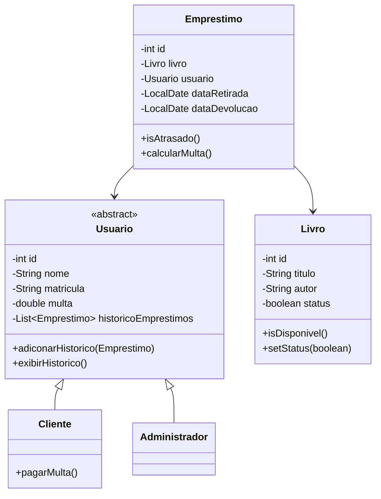

# Bibliotech

Bibliotech is a console-based library management system developed collaboratively as an academic project for an Object-Oriented Programming course. It allows the management of books, users (clients and administrators), book loans, returns, and overdue fines, persisting all data in a PostgreSQL database.

The project was built by three students as a practical exercise in applying object-oriented principles, layered architecture, and unit testing in Java.

## Overview

Bibliotech addresses a small, well-defined problem: keeping a record of the books owned by a library, the users that can borrow them, and the loans that are currently active, while enforcing the basic business rules of a lending workflow.

From an academic standpoint, the system is intentionally simple in scope but deliberately structured to exercise core Object-Oriented Programming concepts:

- Separation of responsibilities across Model, View, Controller, and DAO layers.
- Use of interfaces, abstract classes, and inheritance to model domain variation.
- Encapsulation of state behind well-defined accessors.
- Persistence isolation through the DAO pattern.
- Automated testing with JUnit 5 and Mockito.

## Features

The system supports the following operations, which are actually implemented in the source code:

- **Book management (CRUD):** register, list, search by id, update, and remove books. Each book stores a title, an author, and an availability flag.
- **User management (CRUD):** register, list, search by id, update, and remove users. Users are modeled as `Cliente` or `Administrador`.
- **Loan creation:** create a loan for a given book and user, with automatic registration of the loan and pickup dates, and a return deadline of seven days.
- **Loan validation rules:** a loan is rejected when the book does not exist, when the book is already on loan, or when the user has a pending fine.
- **Book return:** close the active loan for a book and mark the book as available again.
- **Overdue fines:** when a return happens after the deadline, a fine is calculated and added to the user's accumulated fine balance.
- **Fine payment:** clients can pay their pending fine, resetting it to zero.
- **Console interface:** text-based menus for clients and administrators, including listings of active loans and users with pending fines.
- **Persistence in PostgreSQL:** books, users, and active loans are stored in a relational database accessed through JDBC.

## Object-Oriented Design

The implementation of Bibliotech demonstrates several OOP concepts that can be observed directly in the code:

- **Classes and objects.** Domain entities (`Livro`, `Emprestimo`, `Usuario`) and infrastructure classes (`BibliotecaController`, `BibliotecaView`, DAOs) are organized as classes that interact through objects.
- **Encapsulation.** Each class keeps its fields private and exposes access through getters and setters where mutation is needed. For example, `Usuario` exposes its loan history through an unmodifiable view.
- **Abstraction.** `Usuario` is declared as an abstract class, providing a common base while leaving role-specific behavior to its subclasses.
- **Inheritance.** `Cliente` and `Administrador` extend `Usuario`, reusing identification, fine, and history state.
- **Polymorphism.** DAOs are referenced through the generic `DAO<T>` interface, and the controller works with `Usuario` references while the runtime type (`Cliente` or `Administrador`) decides the concrete behavior, such as which fine-payment rule applies.
- **Interfaces.** `DAO<T>` defines the persistence contract (`save`, `findById`, `findAll`, `update`, `delete`) implemented by `LivroDAO`, `UsuarioDAO`, and `EmprestimoDAO`.
- **Layered organization (MVC + DAO).** The code is split into `view`, `controller`, `model`, `dao`, and `connection` packages, each with a single responsibility.
- **DAO pattern.** All SQL access lives in the DAO classes, isolating the rest of the system from JDBC.
- **Custom exceptions for business rules.** `LivroNaoEncontradoException`, `LivroIndisponivelException`, and `MultaPendenteException` make rule violations explicit and testable.
- **Dependency injection in tests.** Tests use Mockito's `@Mock` and `@InjectMocks` to inject DAOs into the controller, keeping unit tests independent from the database.

## Architecture

Bibliotech follows a layered architecture similar to a classical MVC + DAO structure. The runtime flow of a request goes through the View, the Controller, the appropriate DAO, the connection factory, and finally PostgreSQL.

```text
BibliotecaView
        |
        v
BibliotecaController
        |
        v
LivroDAO / UsuarioDAO / EmprestimoDAO
        |
        v
ConnectionFactory
        |
        v
PostgreSQL
```

Responsibilities of each layer:

- `view` (`BibliotecaView`): reads user input from the console, displays menus and results, and converts controller exceptions into user-friendly messages.
- `controller` (`BibliotecaController`): applies the business rules of the library, validates the inputs of operations such as loan creation, return, and fine payment, and orchestrates the DAOs.
- `model` (`Livro`, `Usuario`, `Cliente`, `Administrador`, `Emprestimo`): represents the domain entities, including behaviors that belong to the entities themselves, such as `Emprestimo.isAtrasado()` and `Emprestimo.calcularMulta()`.
- `dao` (`DAO`, `LivroDAO`, `UsuarioDAO`, `EmprestimoDAO`): translates domain operations into SQL statements and maps query results back into objects.
- `connection` (`ConnectionFactory`): centralizes the creation of JDBC connections to PostgreSQL.

## Domain Model

The main domain classes and their relationships are:

- `Usuario` (abstract) is the base class for everyone who interacts with the library.
- `Cliente` and `Administrador` are concrete subclasses of `Usuario`, distinguished by their role and, in the case of `Cliente`, by the ability to pay fines.
- `Livro` represents a title in the catalog, with a title, an author, and an availability status.
- `Emprestimo` connects a `Livro` and a `Usuario`, recording the pickup date and the expected return date (pickup date plus seven days).



## Technologies

The technologies used in the project are confirmed by `pom.xml` and the source code:

- **Language:** Java 17 (configured through `maven.compiler.source` / `maven.compiler.target` in `pom.xml`).
- **Build tool:** Apache Maven, with the Maven Wrapper (`mvnw` / `mvnw.cmd`) included in the repository.
- **Database:** PostgreSQL, accessed through the official JDBC driver (`org.postgresql:postgresql:42.7.3`).
- **Testing:** JUnit 5 (`org.junit.jupiter:junit-jupiter:5.10.2`) and Mockito (`org.mockito:mockito-core` and `mockito-junit-jupiter`, both at `5.12.0`).
- **Maven Surefire Plugin:** `3.2.5`, used to run the test suite.
- **User interface:** a Java console application using `java.util.Scanner`.

The project does not use Spring, Hibernate, or any other framework. The presence of `application.properties` containing only `spring.application.name=bibliotech` does not mean Spring is in use; Spring is not declared as a dependency in `pom.xml`.

## Project Structure

```text
src/main/java/com/marcelo/bibliotech
├── BibliotechApplication.java
├── connection/
│   └── ConnectionFactory.java
├── controller/
│   ├── BibliotecaController.java
│   ├── LivroIndisponivelException.java
│   ├── LivroNaoEncontradoException.java
│   └── MultaPendenteException.java
├── dao/
│   ├── DAO.java
│   ├── EmprestimoDAO.java
│   ├── LivroDAO.java
│   └── UsuarioDAO.java
├── model/
│   ├── Administrador.java
│   ├── Cliente.java
│   ├── Emprestimo.java
│   ├── Livro.java
│   └── Usuario.java
└── view/
    └── BibliotecaView.java
```

- `BibliotechApplication` contains the `main` method and wires the controller and the view together.
- `connection` centralizes JDBC connection creation.
- `controller` contains the business rules and the custom exceptions used to express rule violations.
- `dao` contains the generic `DAO<T>` interface and the concrete persistence classes.
- `model` contains the domain entities, including the abstract `Usuario` and its subclasses.
- `view` contains the console-based user interface.

The `docs/` directory contains additional internal documentation in Portuguese (architecture, database, and flows) that complements the source code. The `src/test/java/...` directory contains the automated tests.

## Database

Bibliotech persists its data in a PostgreSQL database named `biblioteca`, accessed through plain JDBC.

- **Connection management.** `ConnectionFactory` exposes a static `getConnection()` method that uses `DriverManager` to open a connection to `jdbc:postgresql://localhost:5432/biblioteca`. All DAOs obtain their connections from this factory.
- **Persistence approach.** There is no ORM. Each DAO opens and closes its own connection inside `try-with-resources` blocks and executes parameterized SQL statements with `PreparedStatement`.
- **Schema.** The schema is described in detail in `docs/database.md` and consists of three tables:
  - `livros` (`id`, `titulo`, `autor`, `disponivel`)
  - `usuarios` (`id`, `nome`, `matricula`, `multa`, `tipo`)
  - `emprestimos` (`id`, `livro_id`, `usuario_id`, `data_retirada`, `data_devolucao`)
- **Business rules not enforced in the database.** Book availability, the seven-day loan period, the R$ 2,00 daily fine, the fine-blocking rule for new loans, and the deletion of loans on return are all enforced in the Java code, not via database triggers.
- **No persisted loan history.** When a loan is returned, the corresponding row is removed from `emprestimos`. The loan history kept on each `Usuario` object lives only in memory for the duration of the program.

### Database credentials in the repository

The `ConnectionFactory` class currently contains hard-coded PostgreSQL credentials (a username and a default development password) in the source tree. These are local development values and should be replaced with environment variables, a `.properties` file outside version control, or a secrets manager before deploying the application anywhere. See the notes section at the end of this README for details.

## Tests

The project includes automated tests that exercise both domain behavior and controller orchestration.

- **Test framework:** JUnit 5 (`junit-jupiter` 5.10.2) together with Mockito (`mockito-core` and `mockito-junit-jupiter`, both 5.12.0) for mocking the DAOs.
- **Test types:**
  - `LivroTeste`: registration, listing, search, update, removal, and basic field validation for `Livro`.
  - `UsuarioTeste`: registration, listing, search, update, removal, and history behavior for `Usuario`.
  - `TestsEmprestismos`: loan creation, unavailable book, on-time return, late return with fine, missing active loan, and loan history behavior.
  - `TratamentoErrosTeste`: custom-exception scenarios, including null books, users with pending fines, unavailable books, and the corresponding exception messages.
  - `BibliotechApplicationTests`: a manual runnable harness that exercises the DAOs against a real database. It is not a JUnit test and is meant for local smoke testing.
- **How to run the tests:**

  ```bash
  ./mvnw test
  ```

  on Windows, the equivalent is:

  ```bash
  mvnw.cmd test
  ```

The DAO and integration-style tests rely on a running PostgreSQL instance configured as described in the next section.

## Getting Started

### Prerequisites

- Java Development Kit (JDK) 17.
- Apache Maven 3.x, or simply the Maven Wrapper bundled with the repository (`mvnw` / `mvnw.cmd`).
- A running PostgreSQL server reachable at `localhost:5432`, with a database named `biblioteca`.

### Database Setup

Create the schema described in `docs/database.md`. The required tables can be created with statements equivalent to:

```sql
CREATE TABLE livros (
    id         SERIAL PRIMARY KEY,
    titulo     VARCHAR(255) NOT NULL,
    autor      VARCHAR(255) NOT NULL,
    disponivel BOOLEAN NOT NULL DEFAULT TRUE
);

CREATE TABLE usuarios (
    id        SERIAL PRIMARY KEY,
    nome      VARCHAR(255) NOT NULL,
    matricula VARCHAR(50)  NOT NULL,
    multa     DECIMAL(10,2) NOT NULL DEFAULT 0.00,
    tipo      VARCHAR(20)  NOT NULL
);

CREATE TABLE emprestimos (
    id             SERIAL PRIMARY KEY,
    livro_id       INT NOT NULL REFERENCES livros(id),
    usuario_id     INT NOT NULL REFERENCES usuarios(id),
    data_retirada  DATE NOT NULL,
    data_devolucao DATE NOT NULL
);
```

### Configuration

`ConnectionFactory` is currently configured to connect to `jdbc:postgresql://localhost:5432/biblioteca` with a local development user. Update the `URL`, `USER`, and `PASSWD` constants in that class, or refactor it to read from environment variables, before connecting to a different environment.

### Running the Application

After compiling, run the program with:

```bash
./mvnw compile exec:java -Dexec.mainClass=com.marcelo.bibliotech.BibliotechApplication
```

or, on Windows:

```bash
mvnw.cmd compile exec:java -Dexec.mainClass=com.marcelo.bibliotech.BibliotechApplication
```

When the application starts, the console menu lets you log in as a client or as an administrator, then perform the operations listed above.

### Running Tests

```bash
./mvnw test
```

or, on Windows:

```bash
mvnw.cmd test
```

## Academic Context

Bibliotech was developed as a collaborative academic project for an Object-Oriented Programming course. The goal was to apply, in a single coherent codebase, the main concepts covered in the course: encapsulation, abstraction, inheritance, polymorphism, interfaces, layered organization, the DAO pattern, custom exceptions, and unit testing with mocks. The project is intentionally limited in scope and is not a production system.

## Contributors

Bibliotech was developed collaboratively by three students:

- [Marcelo](https://github.com/omarcelodev) — primary author of the project's architecture, the model, DAO, controller, and view layers, the database integration, the documentation, and most of the test suite.
- [Ana Lu](https://github.com/anallu-p) — contributed unit tests for the `Livro` entity, including field validation cases, and the early test scaffolding of the project.
- [Rafael](https://github.com/Rafael15Mesquita) — contributed the dedicated test suites for users and for the error-handling paths of the controller (`UsuarioTeste` and `TratamentoErrosTeste`).

These responsibilities are derived from the Git history; commit-level contributions outside the ones above were performed by the team as a whole.

## What We Learned

Working on Bibliotech gave us hands-on practice with the topics covered in the course:

- Designing a small but coherent object model with an abstract base class and concrete subclasses.
- Applying encapsulation by hiding fields behind accessors and exposing read-only collections where appropriate.
- Using interfaces (`DAO<T>`) and polymorphism to keep the controller independent from the concrete persistence implementation.
- Structuring the code into MVC + DAO layers, so that the user interface, the business rules, and the data access are clearly separated.
- Expressing business-rule violations as custom exceptions that can be caught and tested.
- Managing JDBC connections explicitly through a `ConnectionFactory`, using `PreparedStatement` and `try-with-resources`.
- Writing unit tests with JUnit 5 and Mockito, including the use of `@Mock` and `@InjectMocks` to test the controller in isolation.
- Collaborating on a shared codebase through feature branches and pull requests, and documenting both the architecture and the database in the `docs/` directory.

## License

No license file is included in this repository. Unless a license is added later, the code is subject to the default copyright rules of the project owner.
