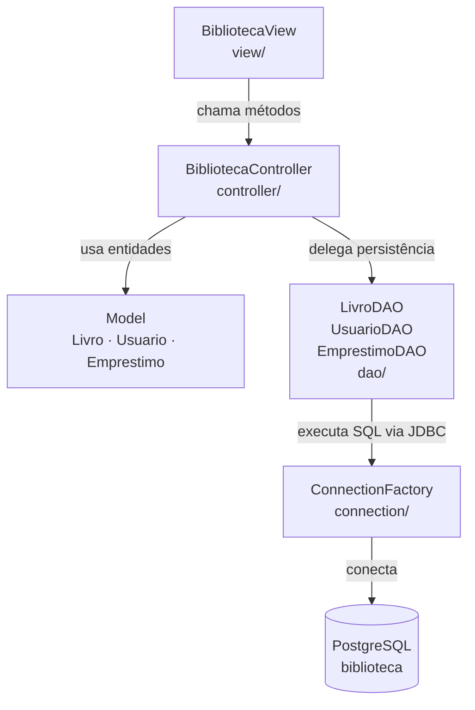

# Arquitetura do Sistema — BiblioTech

## Visão Geral

O BiblioTech segue o padrão **MVC (Model-View-Controller)** com uma camada de acesso a dados (DAO) separada.
A ideia central é que cada camada tem uma única responsabilidade — como andares de um prédio, onde cada um cuida do seu próprio trabalho.

---

## Diagrama de Camadas



---

## Responsabilidade de Cada Camada

### `view/` — Interface com o Usuário
- Classe: `BibliotecaView`
- Responsável por **ler entradas do terminal e exibir resultados**
- Não contém regras de negócio — apenas repassa dados ao Controller
- Captura as exceções lançadas pelo Controller e exibe mensagens amigáveis

### `controller/` — Regras de Negócio
- Classe: `BibliotecaController`
- **Único lugar onde as regras de negócio vivem**
- Valida condições antes de persistir (livro disponível, multa pendente, etc.)
- Lança exceções específicas para cada violação de regra:
  - `LivroNaoEncontradoException`
  - `LivroIndisponivelException`
  - `MultaPendenteException`

### `model/` — Entidades do Domínio
- Classes: `Livro`, `Usuario`, `Emprestimo`
- Representam os objetos reais do sistema
- Contêm apenas dados e comportamentos intrínsecos à entidade
  - Ex: `Emprestimo.calcularMulta()`, `Emprestimo.isAtrasado()`
- **Não acessam o banco diretamente**

### `dao/` — Acesso ao Banco de Dados
- Classes: `LivroDAO`, `UsuarioDAO`, `EmprestimoDAO`
- Todas implementam a interface genérica `DAO<T>`
- Responsáveis por **traduzir objetos Java em operações SQL** (e vice-versa)
- Isolam completamente o restante do sistema do PostgreSQL

### `connection/` — Fábrica de Conexão
- Classe: `ConnectionFactory`
- Centraliza as configurações de conexão JDBC (URL, usuário, senha)
- Todos os DAOs obtêm conexões exclusivamente por aqui

---

## Fluxo de uma Requisição (exemplo: Empréstimo)

```
BibliotecaView
    └─→ controller.realizarEmprestimo(livro, usuario)
            └─→ valida regras de negócio
            └─→ emprestimoDAO.save(emprestimo)
                    └─→ ConnectionFactory.getConnection()
                    └─→ executa INSERT no PostgreSQL
            └─→ livroDAO.update(livro)   ← marca como indisponível
```

---

## Dependências Externas

| Dependência | Versão | Uso |
|---|---|---|
| PostgreSQL JDBC Driver | 42.7.3 | Conexão com o banco de dados |
| Java | 17 | Linguagem base do projeto |
| Apache Maven | 3.9.14 | Build e gerenciamento de dependências |

---

## Pontos de Extensão

Caso o sistema precise evoluir, os principais pontos de mudança são:

- **Trocar o banco de dados** → apenas `ConnectionFactory` e os DAOs precisam mudar
- **Adicionar interface web/API** → apenas a camada `view/` precisa ser substituída
- **Novas regras de negócio** → concentradas em `BibliotecaController`
