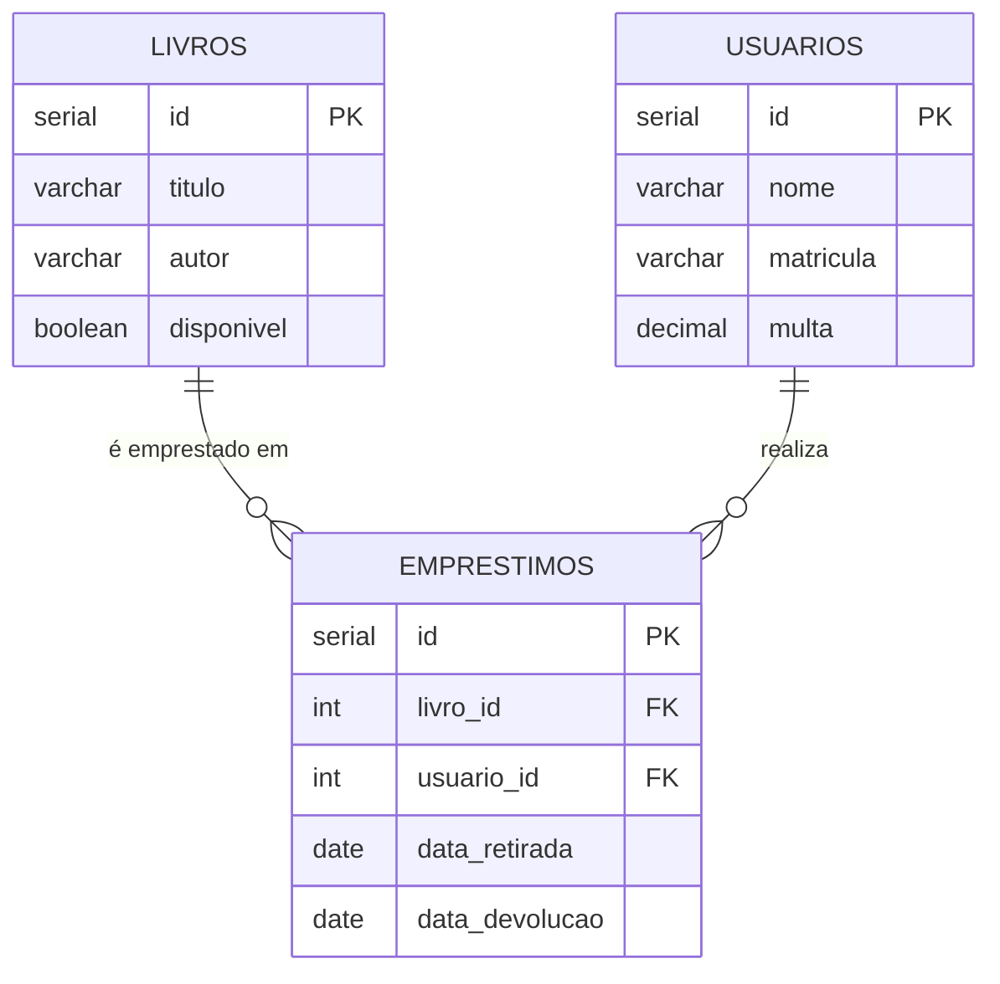

# Modelo do Banco de Dados — BiblioTech

## Visão Geral

O sistema utiliza **PostgreSQL** com 3 tabelas principais.
Pense no banco como o "arquivo físico" da biblioteca — cada gaveta (tabela) guarda um tipo de informação, e os empréstimos ligam livros a usuários.

---

## Diagrama Entidade-Relacionamento



---

## Descrição das Tabelas

### `livros`
Armazena o acervo da biblioteca.

| Coluna      | Tipo      | Descrição                                      |
|-------------|-----------|------------------------------------------------|
| `id`        | SERIAL PK | Identificador gerado automaticamente           |
| `titulo`    | VARCHAR   | Título do livro                                |
| `autor`     | VARCHAR   | Nome do autor                                  |
| `disponivel`| BOOLEAN   | `true` = disponível para empréstimo, `false` = emprestado |

---

### `usuarios`
Armazena os usuários cadastrados na biblioteca.

| Coluna      | Tipo      | Descrição                                      |
|-------------|-----------|------------------------------------------------|
| `id`        | SERIAL PK | Identificador gerado automaticamente           |
| `nome`      | VARCHAR   | Nome completo do usuário                       |
| `matricula` | VARCHAR   | Matrícula do usuário                           |
| `multa`     | DECIMAL   | Valor acumulado de multas em reais (padrão: 0) |

---

### `emprestimos`
Registra os empréstimos ativos. Um empréstimo é **deletado** ao ser devolvido — não há histórico persistido no banco.

| Coluna           | Tipo      | Descrição                              |
|------------------|-----------|----------------------------------------|
| `id`             | SERIAL PK | Identificador gerado automaticamente   |
| `livro_id`       | INT FK    | Referência ao livro emprestado         |
| `usuario_id`     | INT FK    | Referência ao usuário que pegou        |
| `data_retirada`  | DATE      | Data em que o empréstimo foi realizado |
| `data_devolucao` | DATE      | Prazo para devolução (retirada + 7 dias) |

---

## SQL de Criação

```sql
CREATE TABLE livros (
    id         SERIAL PRIMARY KEY,
    titulo     VARCHAR(255) NOT NULL,
    autor      VARCHAR(255) NOT NULL,
    disponivel BOOLEAN NOT NULL DEFAULT TRUE
);

CREATE TABLE usuarios (
    id         SERIAL PRIMARY KEY,
    nome       VARCHAR(255) NOT NULL,
    matricula  VARCHAR(50)  NOT NULL,
    multa      DECIMAL(10,2) NOT NULL DEFAULT 0.00
);

CREATE TABLE emprestimos (
    id             SERIAL PRIMARY KEY,
    livro_id       INT NOT NULL REFERENCES livros(id),
    usuario_id     INT NOT NULL REFERENCES usuarios(id),
    data_retirada  DATE NOT NULL,
    data_devolucao DATE NOT NULL
);
```

---

## Regras de Negócio Vinculadas ao Banco

Estas regras **não estão no banco** (sem triggers), mas o código as aplica e o banco precisa respeitá-las:

| Regra | Onde é aplicada | Detalhe |
|---|---|---|
| Livro inicia como disponível | `Livro.java` + SQL DEFAULT | `disponivel = true` por padrão |
| Livro fica indisponível ao emprestar | `BibliotecaController` | UPDATE após INSERT no empréstimo |
| Livro volta a disponível ao devolver | `BibliotecaController` | UPDATE antes de DELETE no empréstimo |
| Multa acumula no usuário | `BibliotecaController` | Soma ao valor atual no UPDATE |
| Multa bloqueia novo empréstimo | `BibliotecaController` | Validação antes de qualquer INSERT |
| Empréstimo deletado na devolução | `EmprestimoDAO` | Não há tabela de histórico no banco |
| Prazo padrão é 7 dias | `Emprestimo.java` | Constante `DIAS_PRAZO = 7` |
| Multa de R$2,00 por dia de atraso | `Emprestimo.java` | Constante `MULTA_POR_DIA = 2.0` |

---

## Atenção: Ausência de Histórico

O sistema **deleta** o empréstimo ao realizar a devolução. Isso significa:

- Não é possível consultar empréstimos passados pelo banco
- O histórico em `Usuario.historicoEmprestimos` existe **apenas em memória** durante a execução
- Se futuramente precisar de histórico persistido, será necessário criar uma tabela `historico_emprestimos` e adaptar o `EmprestimoDAO`
