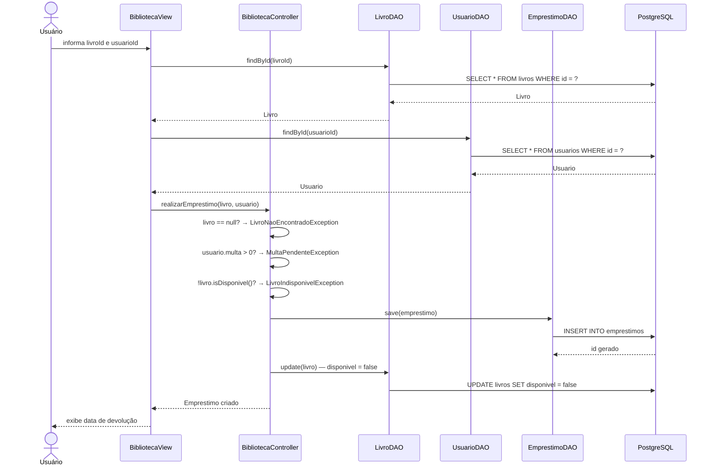
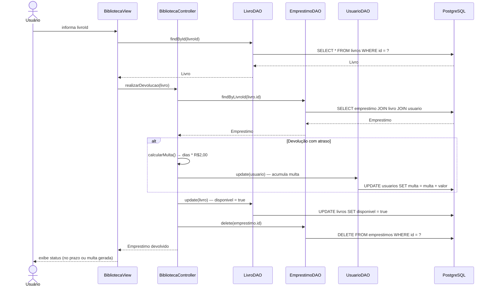

# Fluxos de Uso — BiblioTech

## Visão Geral

Este documento descreve os dois fluxos críticos do sistema: **empréstimo** e **devolução**.
Pense neles como receitas de bolo — cada passo precisa acontecer na ordem certa, e qualquer ingrediente errado interrompe o processo com uma exceção.

---

## Fluxo 1 — Realizar Empréstimo

### Caminho feliz (sem erros)

### Passo a passo detalhado

| # | Passo | Responsável | Detalhe |
|---|-------|-------------|---------|
| 1 | Usuário informa livroId e usuarioId | `BibliotecaView` | Leitura via Scanner |
| 2 | Busca livro no banco | `LivroDAO.findById()` | Retorna `null` se não existir |
| 3 | Busca usuário no banco | `UsuarioDAO.findById()` | Retorna `null` se não existir |
| 4 | Valida se livro existe | `BibliotecaController` | `null` → `LivroNaoEncontradoException` |
| 5 | Valida se usuário tem multa | `BibliotecaController` | `multa > 0` → `MultaPendenteException` |
| 6 | Valida se livro está disponível | `BibliotecaController` | `disponivel = false` → `LivroIndisponivelException` |
| 7 | Cria o empréstimo | `Emprestimo.java` | `dataRetirada = hoje`, `dataDevolucao = hoje + 7 dias` |
| 8 | Persiste o empréstimo | `EmprestimoDAO.save()` | INSERT na tabela `emprestimos` |
| 9 | Marca livro como indisponível | `LivroDAO.update()` | UPDATE `disponivel = false` |
| 10 | Exibe confirmação | `BibliotecaView` | Mostra data de devolução ao usuário |

### Possíveis erros

| Exceção | Causa | Mensagem exibida |
|---------|-------|-----------------|
| `LivroNaoEncontradoException` | Livro não encontrado no banco | "o livro nao foi encontrado no sistema." |
| `MultaPendenteException` | Usuário possui multa em aberto | "o cliente X possui multa pendente de R$ Y..." |
| `LivroIndisponivelException` | Livro já está emprestado | "O livro esta indisponivel no momento!" |

---

## Fluxo 2 — Realizar Devolução

### Caminho feliz (sem erros)

### Passo a passo detalhado

| # | Passo | Responsável | Detalhe |
|---|-------|-------------|---------|
| 1 | Usuário informa livroId | `BibliotecaView` | Leitura via Scanner |
| 2 | Busca livro no banco | `LivroDAO.findById()` | Retorna `null` se não existir |
| 3 | Busca empréstimo ativo pelo livro | `EmprestimoDAO.findByLivroId()` | Retorna `null` se livro não estiver emprestado |
| 4 | Verifica atraso | `Emprestimo.isAtrasado()` | `hoje > dataDevolucao` |
| 5a | **Se atrasado:** calcula multa | `Emprestimo.calcularMulta()` | `diasAtraso * R$2,00` |
| 5b | **Se atrasado:** acumula multa no usuário | `UsuarioDAO.update()` | Soma ao valor já existente |
| 6 | Marca livro como disponível | `LivroDAO.update()` | UPDATE `disponivel = true` |
| 7 | Deleta o empréstimo | `EmprestimoDAO.delete()` | DELETE — sem histórico persistido |
| 8 | Exibe resultado | `BibliotecaView` | "no prazo" ou "atraso + valor da multa" |

### Possíveis erros

| Situação | Causa | Comportamento |
|----------|-------|---------------|
| Livro não encontrado | `findById()` retorna `null` | View exibe "Livro não encontrado" e encerra |
| Nenhum empréstimo ativo | `findByLivroId()` retorna `null` | View exibe "Nenhum empréstimo ativo para este livro" |
| Devolução com atraso | `hoje > dataDevolucao` | Multa calculada e acumulada no usuário |

---

## Regras de Negócio dos Fluxos

| Regra | Valor | Definido em |
|-------|-------|-------------|
| Prazo de devolução | 7 dias após retirada | `Emprestimo.DIAS_PRAZO` |
| Multa por dia de atraso | R$ 2,00 | `Emprestimo.MULTA_POR_DIA` |
| Multa bloqueia empréstimo | Qualquer valor > 0 | `BibliotecaController.realizarEmprestimo()` |
| Multa acumula (não substitui) | Soma ao valor existente | `BibliotecaController.realizarDevolucao()` |
| Empréstimo deletado na devolução | Sem histórico no banco | `EmprestimoDAO.delete()` |
